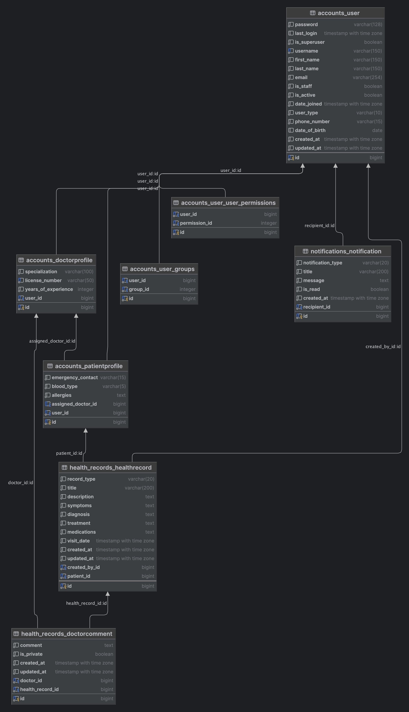

# Health Record API - Django Assessment Project

Secure REST API for managing personal health records with patient-doctor relationships

🌐 **Live Demo**: https://health-record-api-assessment-production.up.railway.app/  
📚 **API Documentation**: https://health-record-api-assessment-production.up.railway.app/api-docs/  
🔗 **GitHub Repository**: https://github.com/mateenqazi/health-record-api-assessment

## 📋 Assessment Requirements Fulfilled

### ✅ Core Requirements
- **User Registration & Authentication** - JWT-based with 5-minute token expiry
- **Patient Health Record Management** - Full CRUD operations with ownership control
- **Doctor Record Viewing & Annotation** - Access to assigned patients' records only
- **Strict Access Control** - Role-based permissions with data isolation
- **Automatic Notifications** - Celery-based background processing for doctor assignments
- **Modern Django REST Framework** - Clean, modular architecture with best practices

### ✅ Technical Excellence
- **Secure Token Management** - Short-lived JWT tokens with refresh mechanism
- **RESTful API Design** - Clean endpoints with proper HTTP methods and status codes
- **Background Processing** - Non-blocking notifications using Celery and Redis
- **Database Security** - PostgreSQL with proper relationships and constraints
- **Production Deployment** - Live demo deployed on Railway with managed databases

## 🏗️ Architecture & Design Decisions

### Technology Stack
- **Backend Framework**: Django 4.2 + Django REST Framework 3.14
- **Database**: PostgreSQL (production) / Local PostgreSQL (development)
- **Authentication**: JWT with djangorestframework-simplejwt
- **Background Processing**: Celery with Redis broker
- **Deployment**: Railway (with managed PostgreSQL and Redis)
- **Static Files**: WhiteNoise for production static file serving

### Key Design Decisions

#### 1. JWT Authentication with Short Expiry
```python
SIMPLE_JWT = {
    'ACCESS_TOKEN_LIFETIME': timedelta(minutes=5),  # Security requirement
    'REFRESH_TOKEN_LIFETIME': timedelta(days=1),
    'ROTATE_REFRESH_TOKENS': True,
}
```
**Rationale**: Enhances security for sensitive health data while maintaining usability through refresh tokens.

#### 2. Role-Based User Model
```python
class User(AbstractUser):
    USER_TYPE_CHOICES = [
        ('PATIENT', 'Patient'),
        ('DOCTOR', 'Doctor'),
    ]
    user_type = models.CharField(max_length=10, choices=USER_TYPE_CHOICES)
```
**Rationale**: Clean separation of user types with dedicated profile models for role-specific data.

#### 3. Custom Permission Classes
```python
class IsPatientOwnerOrAssignedDoctor(permissions.BasePermission):
    def has_object_permission(self, request, view, obj):
        # Patients can access their own records
        if user.user_type == 'PATIENT':
            return obj.patient.user == user
        # Doctors can access assigned patients' records
        if user.user_type == 'DOCTOR':
            return obj.patient.assigned_doctor == user.doctorprofile
```
**Rationale**: Ensures strict data isolation and access control for sensitive health information.

#### 4. Asynchronous Notifications
```python
@shared_task
def send_patient_assignment_notification(doctor_id, patient_name):
    Notification.objects.create(
        recipient=doctor,
        notification_type='PATIENT_ASSIGNED',
        title='New Patient Assigned',
        message=f'You have been assigned a new patient: {patient_name}'
    )
```
**Rationale**: Non-blocking operations improve user experience and system responsiveness.

## 📁 Project Structure

```
health_record_api/
├── health_record_api/          # Main project configuration
│   ├── settings.py            # Environment-specific settings
│   ├── urls.py               # Main URL routing with API documentation
│   ├── wsgi.py               # WSGI configuration
│   └── celery.py             # Celery configuration
├── accounts/                  # User management & authentication
│   ├── models.py             # User, DoctorProfile, PatientProfile
│   ├── serializers.py        # Registration, login, profile serializers
│   ├── views.py              # Authentication endpoints
│   ├── admin.py              # Django admin configuration
│   └── urls.py               # Authentication routes
├── health_records/            # Health record management
│   ├── models.py             # HealthRecord, DoctorComment
│   ├── serializers.py        # Health record CRUD serializers
│   ├── views.py              # Health record endpoints
│   ├── permissions.py        # Custom permission classes
│   ├── signals.py            # Auto-notification triggers
│   ├── admin.py              # Admin interface
│   └── urls.py               # Health record routes
├── notifications/             # Notification system
│   ├── models.py             # Notification model
│   ├── serializers.py        # Notification serializers
│   ├── views.py              # Notification endpoints
│   ├── tasks.py              # Celery background tasks
│   └── urls.py               # Notification routes
├── tests/                     # Test suite
│   ├── test_auth.py          # Authentication tests
│   └── test_health_records.py # Health record tests
├── requirements.txt           # Python dependencies
├── Procfile                   # Railway deployment configuration
├── .env.example              # Environment variables template
└── README.md                 # Project documentation
```

## 🔐 Security Features

### Authentication & Authorization
- **JWT Tokens**: 5-minute access tokens with secure refresh mechanism
- **Role-Based Access Control**: Patients vs. Doctors with distinct permissions
- **Data Isolation**: Users can only access their own data or assigned patients
- **Secure Password Storage**: Django's built-in PBKDF2 password hashing

### API Security
- **Permission Classes**: Custom permissions for object-level access control
- **Input Validation**: Comprehensive serializer validation with error handling
- **HTTPS Enforcement**: Secure headers and SSL redirect in production
- **CORS Protection**: Configured for secure cross-origin requests

### Database Security
- **Parameterized Queries**: Django ORM prevents SQL injection
- **Foreign Key Constraints**: Proper database relationships and referential integrity
- **Migration Safety**: Version-controlled database schema changes

## 🚀 API Endpoints

### Authentication
| Method | Endpoint | Description | Access |
|--------|----------|-------------|--------|
| POST | `/api/auth/register/` | User registration | Public |
| POST | `/api/auth/login/` | User login | Public |
| POST | `/api/auth/token/refresh/` | Refresh JWT token | Public |
| GET | `/api/auth/profile/` | Get user profile | Authenticated |
| PUT | `/api/auth/profile/` | Update user profile | Authenticated |
| GET | `/api/auth/doctors/` | List available doctors | Authenticated |
| POST | `/api/auth/assign-doctor/` | Assign doctor to patient | Doctor/Admin |

### Health Records
| Method | Endpoint | Description | Access |
|--------|----------|-------------|--------|
| GET | `/api/health-records/` | List health records | Authenticated |
| POST | `/api/health-records/` | Create health record | Patients only |
| GET | `/api/health-records/{id}/` | Get specific record | Owner/Assigned Doctor |
| PUT | `/api/health-records/{id}/` | Update health record | Patients only |
| DELETE | `/api/health-records/{id}/` | Delete health record | Patients only |
| POST | `/api/health-records/{id}/comments/` | Add doctor comment | Assigned Doctor |
| GET | `/api/health-records/my-patients/` | List assigned patients | Doctors only |

### Notifications
| Method | Endpoint | Description | Access |
|--------|----------|-------------|--------|
| GET | `/api/notifications/` | List user notifications | Authenticated |
| POST | `/api/notifications/{id}/read/` | Mark notification as read | Authenticated |
| POST | `/api/notifications/mark-all-read/` | Mark all as read | Authenticated |

## 💾 Database Schema

### Core Models

### Database Relationship Diagram


#### User Model (Custom AbstractUser)
```python
class User(AbstractUser):
    user_type = models.CharField(max_length=10, choices=USER_TYPE_CHOICES)
    phone_number = models.CharField(max_length=15, blank=True)
    date_of_birth = models.DateField(null=True, blank=True)
    created_at = models.DateTimeField(auto_now_add=True)
    updated_at = models.DateTimeField(auto_now=True)
```

#### Health Record Model
```python
class HealthRecord(models.Model):
    patient = models.ForeignKey(PatientProfile, on_delete=models.CASCADE)
    record_type = models.CharField(max_length=20, choices=RECORD_TYPE_CHOICES)
    title = models.CharField(max_length=200)
    description = models.TextField(blank=True)
    symptoms = models.TextField(blank=True)
    diagnosis = models.TextField(blank=True)
    treatment = models.TextField(blank=True)
    medications = models.TextField(blank=True)
    visit_date = models.DateTimeField()
    created_by = models.ForeignKey(User, on_delete=models.CASCADE)
```

#### Doctor-Patient Relationship
```python
class PatientProfile(models.Model):
    user = models.OneToOneField(User, on_delete=models.CASCADE)
    assigned_doctor = models.ForeignKey(DoctorProfile, on_delete=models.SET_NULL, null=True)
    emergency_contact = models.CharField(max_length=15)
    blood_type = models.CharField(max_length=5, blank=True)
    allergies = models.TextField(blank=True)
```

## ⚙️ Setup & Installation

### Prerequisites
- Python 3.8+
- PostgreSQL
- Redis (for Celery)

### Local Development Setup

#### 1. Clone Repository
```bash
git clone https://github.com/yourusername/health-record-api-assessment.git
cd health-record-api-assessment
```

#### 2. Virtual Environment
```bash
python -m venv health_record_env
source health_record_env/bin/activate  # Windows: health_record_env\Scripts\activate
```

#### 3. Install Dependencies
```bash
pip install -r requirements.txt
```

#### 4. Environment Configuration
```bash
cp .env.example .env
# Edit .env with your database credentials
```

#### 5. Database Setup
```bash
createdb health_records_db
python manage.py migrate
python manage.py createsuperuser
```

#### 6. Start Services
```bash
# Terminal 1: Redis
redis-server

# Terminal 2: Celery Worker
celery -A health_record_api worker --loglevel=info

# Terminal 3: Django Server
python manage.py runserver
```

### Docker Setup (Alternative)
```bash
docker-compose up --build
docker-compose exec web python manage.py migrate
docker-compose exec web python manage.py createsuperuser
```

## 🧪 Testing

### Run Test Suite
```bash
python manage.py test
```

### API Testing Examples

#### User Registration
```bash
curl -X POST http://localhost:8000/api/auth/register/ \
  -H "Content-Type: application/json" \
  -d '{
    "username": "patient1",
    "email": "patient@example.com",
    "password": "securepass123",
    "password_confirm": "securepass123",
    "first_name": "John",
    "last_name": "Doe",
    "user_type": "PATIENT"
  }'
```

#### Create Health Record
```bash
curl -X POST http://localhost:8000/api/health-records/ \
  -H "Content-Type: application/json" \
  -H "Authorization: Bearer YOUR_JWT_TOKEN" \
  -d '{
    "record_type": "CHECKUP",
    "title": "Annual Physical",
    "description": "Routine health examination",
    "visit_date": "2025-05-28T10:00:00Z"
  }'
```

## 🌐 Deployment

### Production Deployment (Railway)
- **Live URL**: https://health-record-api-assessment-production.up.railway.app/
- **Database**: Managed PostgreSQL
- **Cache/Broker**: Managed Redis
- **Static Files**: WhiteNoise
- **Environment**: Production-optimized settings

### Deployment Features
- Automatic deployments from GitHub
- Environment-specific configuration
- Database migrations on deploy
- Secure environment variables
- SSL/HTTPS enforcement

## 📈 Performance & Scalability

### Optimization Features
- **Database Indexing**: Optimized queries with proper indexes
- **Query Optimization**: select_related and prefetch_related for joins
- **Pagination**: Built-in DRF pagination for large datasets
- **Caching**: Redis caching for frequently accessed data
- **Background Processing**: Asynchronous tasks for non-critical operations

### Monitoring & Logging
- Comprehensive error logging
- Request/response logging in production
- Celery task monitoring
- Database query analysis

## 🔧 Code Quality & Best Practices

### Django Best Practices
✅ Custom User model from project start  
✅ Modular app structure with clear separation of concerns  
✅ Environment-specific settings configuration  
✅ Proper migration management  
✅ Django admin integration for content management  

### REST API Best Practices
✅ RESTful URL design and HTTP methods  
✅ Consistent JSON response format  
✅ Proper HTTP status codes  
✅ Comprehensive input validation  
✅ Error handling with descriptive messages  

### Security Best Practices
✅ JWT token authentication with short expiry  
✅ Role-based permission system  
✅ Input sanitization and validation  
✅ Secure password storage  
✅ HTTPS enforcement in production  

## 🎯 Assessment Highlights

### Technical Excellence
- **Authentication System**: Implemented JWT with 5-minute expiry as required
- **Permission System**: Custom permissions ensure strict access control
- **Background Processing**: Celery handles notifications asynchronously
- **Database Design**: Proper relationships with referential integrity
- **API Design**: RESTful endpoints with comprehensive documentation

### Security Implementation
- **Data Isolation**: Patients can only access their own records
- **Role-Based Access**: Doctors limited to assigned patients
- **Token Security**: Short-lived tokens with secure refresh
- **Input Validation**: Comprehensive serializer validation
- **Production Security**: HTTPS, secure headers, and environment variables

### Code Quality
- **Modular Architecture**: Clean separation of accounts, health_records, notifications
- **Django Best Practices**: Custom user model, proper migrations, admin integration
- **Error Handling**: Comprehensive error responses with proper HTTP codes
- **Documentation**: Complete API documentation with examples
- **Testing**: Unit tests for critical functionality

## 📞 API Usage Guide

For complete API documentation with request/response examples, visit:  
https://health-record-api-assessment-production.up.railway.app/api-docs/

## 👨‍💻 Developer Information
- **Technology Stack**: Django + Django REST Framework
- **Deployment**: Railway (PostgreSQL + Redis)
- **Code Quality**: Production-ready with comprehensive testing

This project demonstrates proficiency in Django REST Framework development, secure API design, database modeling, and production deployment practices.